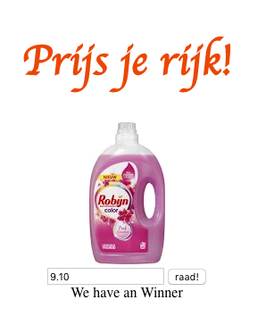

# Oefententamen

## Vraag 1

Leeropbrengsten: 3, 5, 6 en 11 (5 + 5 + 10 + 5 = 25 punten).  
Gegeven is de volgende array van employees. Maak een functie die de oorspronkelijke array als argument neemt en een nieuwe array retourneert waarbij het salaris met 10% dynamisch wordt verhoogt.


```
const employees = [{
        name: 'Jan',
        surname: 'Jansen',
        salary: 35000
    },
    {
        name: 'Kees',
        surname: 'Groot',
        salary: 27000
    },
    {
        name: 'Bert',
        surname: 'Pietersen',
        salary: 30000
    },
    {
        name: 'Wimpie',
        surname: 'Jobsen',
        salary: 21000
    }
];
```

## Vraag 2

Leeropbrengsten: 4 en 9 (10 + 5 = 15 punten).  
Gegeven zijn de volgende categorien voertuigen:
- Categorie 1: auto's, busjes, campers of bestelwagens, waarbij het hoogste punt van het voertuig maximaal 2 meter bedraagt
- Categorie 2: auto's, busjes, campers of bestelwagens, waarbij het hoogste punt van het voertuig meer dan 2 meter maar maximaal 3 meter bedraagt.
- Categorie 3: campers, bussen en bedrijfsvoertuigen met een hoogte van meer dan 3 meter of een toegestane maximummassa van meer dan 3500 kg.  
Maak een beslisstructuur die precies aangeeft in welke categorie een voertuig valt. Maar daarbij gebruik van de onderstaande voertuig object.  

```
const myVan = {
    type: 'auto',
    weight: 1300,
    height: 2.05
}
```

## Vraag 3

Leeropbrengsten: 2 en 5 (5 + 5 = 10 punten).  
a) in onderstaand stuk code worden voornamelijk vars gebruikt. Beargumenteer waarom je misschien beter een const of let kan gebruiken. Doe dit in het commentaar.  
b) in onderstaand stuk code wordt veel code herhaald. Schrijf een generieke functie writeToTheDom die de volgende elementen kan maken p, h1 en img.

```
var placeholder = document.getElementById('wrapper');
var p = document.createElement('p');
p.classList.add('article');
p.innerText = 'new paragraph';
var h1 = document.createElement('h1');
h1.classList.add('headlines');
h1.innerText = 'myNewText'
var image = document.createElement('img');
image.src = './assets/images/buzz.png';
placeholder.appendChild(p);
placeholder.appendChild(h1);
placeholder.appendChild(img);
```

## Vraag 4

Leeropbrengsten: 1, 6, 7, 8, 10, 11, 12, 13 en 14 (5 + 5 + 5 + 5 + 5 + 5 + 10 + 10 + 10 = 60 ).  
  
Gegeven is het bovenstaande plaatje. Probeer de prijs van het product te raden. Het product en de prijs is gegeven. Wanneer de gebruiker een prijs invoert, wordt het ingevoerde getal vergeleken met de daadwerkelijke waarde. Als het ingevoerde getal niet minder is dan 10% van de daadwerkelijke prijs dan heeft de gebruiker de prijs gewonnen en wordt er een bericht geschreven: 'Je hebt gewonnen!' Anders staat er 'Helaas je hebt het niet goed geraden'. De opdracht wordt pas beoordeeld wanneer het product in de DOM staat en wanneer er een bericht naar het de DOM wordt geschreven.

## Beoordelingscriteria

Nr | Leeropbrengsten | Punten
---|---|---
1 | Gebruikt consistente naamgeving | 5
2 | Gebruikt const, let, var in de gevraagde situatie | 5
3 | Gebruikt array's om data in op te slaan | 5
4 | Gebruikt een conditional (if else)| 10
5 | Gebruikt een loop om herhaling van stappen te voorkomen | 10
6 | Schrijft een functie om code te structureren | 10
7 | Schrijft een functie om herhaling te voorkomen | 5
8 | Schrijft commentaar volgens de JS docs richtlijnen | 5
9 | Gebruikt de juiste operatoren bij vergelijkingen | 5
10 | Gebruikt console.log om te debuggen | 5
11 | Gebruikt een object om gestructureerde data in op te slaan | 5
12 | Gebruikt Events voor interactie | 10
13 | Gebruikt DOM methods (interfaces) om HTML elementen te maken en te plaatsen in het DOM | 10
14 | Gebruikt DOM methods (interfaces) methoden om door de DOM te wandelen | 10

## Puntenverdeling

Beoordeling | Cijfer | Aantal punten
---|---|---
onvoldoende | 4 | < 60
matig | 5 | 60 tot 70
voldoende | 6 | 70 tot 80
ruim voldoende | 7 | 80 tot 85
goed | 8 | 85 - 90
zeer goed | 9 | 90 - 95
uitmuntend | 10 | 95 - 100